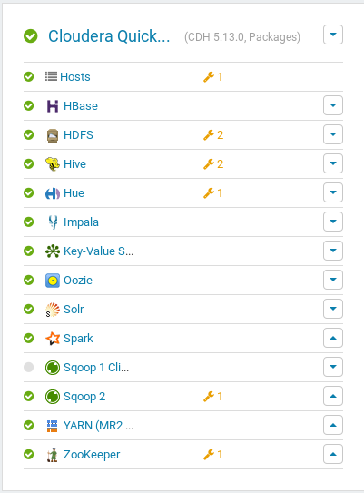

# Spark exercise

## Introduction
This exercise was completed in preparation for the Big Data course at [University of Zanjan](https://www.znu.ac.ir/en) in 2021.

The cloudera-quickstart-vm-5.13.0-0-vmware file, which is actually the cloudera virtual machine, has already been downloaded during the previous exercises and it has been possible to work with it using the VMWare Player 15.5 software.

For this exercise, it is necessary to launch cloudera manager (CM), which was done earlier in the HBase exercise. It is also necessary that the spark service is up, if it is not, you can start the service manually through the interface.

To do the exercises, it is supposed to work with the datasets that were used for the join part of the MapReduce exercise.

The esercise steps is [here](LabPractice5_Spark.pdf)

The report of the work have done is [here](Spark-report.pdf).

------

The esercise steps for Spark DataFrames are [here] (LabPractice6_Spark_DataFrames.pdf)

The report of the work have done is [here](Spark_DF-report.pdf).

